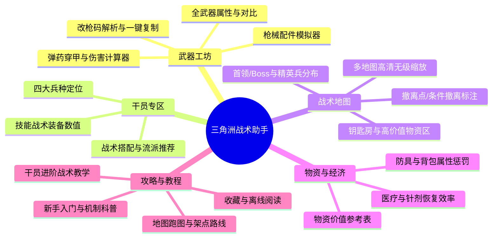
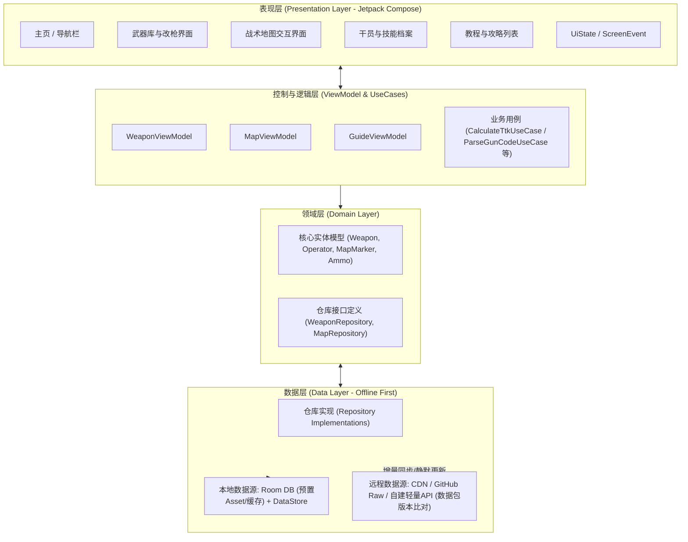

# 《三角洲行动战术助手 (DeltaTactics)》Android App 开发规划与技术设计文档

---

## 1. 项目概述

### 1.1 项目背景
《三角洲行动》（Delta Force）作为一款高人气的战术射击与战术搜打撤（烽火地带/全面战场）游戏，具有丰富的武器配件改装系统、多兵种特勤干员技能机制、复杂的护甲弹药克制关系，以及极具深度的战术地图与撤离机制。
玩家在局外配装、局中搜刮与跑图、战术决策时，需要频繁查询武器配件数值、弹药穿透机制、地图物资点位及干员打法教程。

### 1.2 项目定位
打造一款**界面硬核战术风、轻量秒开、离线优先（Offline-First）、无侵入广告**的《三角洲行动》专属 Android 辅助查询工具。

### 1.3 核心设计原则
1. **离线优先 (Offline-First)**：核心装备数据、配件数值、基础地图随包预置或离线缓存，无网络也能极速秒查。
2. **极速响应与流畅体验**：全原生开发，采用 Jetpack Compose + Material 3 构建现代化声明式界面。
3. **高扩展性**：支持云端热更新静态数据包（JSON/SQLite），游戏版本更新时无需强制重新安装完整 APK 即可同步最新武器数值。

---

## 2. 功能需求规划 (Features & Modules)



### 2.1 武器工坊与改枪模拟 (Weapon & Gunsmith)
- **武器数据库**：
  - 武器分类：突击步枪、冲锋枪、精确射手步枪、狙击步枪、轻机枪、霰弹枪、手枪等。
  - 属性面板：基础伤害、射速、有效射程、后坐力控制（水平/垂直）、操控速度、腰射散布、弹夹容量、换弹时间。
  - 衰减曲线图：直观展示不同距离下的伤害衰减。
  - 武器对比：支持选择 2~3 把武器进行雷达图与多维属性横向对比。
- **配件改装模拟器**：
  - 部位拆解：枪口、枪管、护木/前握把、瞄准镜、弹匣、后握把、枪托等。
  - 配件互斥与连锁联动计算：切换配件实时动态计算武器最终整枪数值变化。
- **改枪方案与改枪码**：
  - 支持直接粘贴游戏内“改枪码”自动识别并加载对应配件搭配方案。
  - 社区推荐热门方案（如烽火地带稳健型、全面战场冲锋型、极速开镜腰射型）。
  - 一键生成/复制改枪码到剪贴板，方便游戏中粘贴。
- **弹药与护甲穿透计算器 (TTK Calculator)**：
  - 穿透机制：展示 1~6 级弹药对 1~6 级头盔/护甲的击穿概率与碎甲减伤。
  - 击杀耗弹数计算：输入目标护甲等级与击中部位，计算击杀所需命中次数与理论 TTK (Time to Kill)。

### 2.2 特勤干员档案 (Operators)
- **干员概览**：按定位分类（突击、侦察、支援、工程）。
- **技能数值详解**：战术装备（小技能）、战术道具、特长（被动技能）详细参数（冷却时间、生效半径、持续时长、破片伤害、透视/侦察范围等）。
- **阵容与相性搭配**：烽火地带 3 人小队推荐组合（如：威龙 + 露娜 + 蜂医），克制关系分析。

### 2.3 战术地图 (Tactical Interactive Maps)
- **覆盖地图**：零号大坝、长弓溪谷、巴克什、航天基地等烽火地带地图及全面战场重点交战区。
- **高清交互式图层控制**：
  - 多级标注开关：可独立开启/隐藏撤离点、钥匙房、高价值物资点（曼德尔砖/电子机房/金卡房）、安全箱、武器箱、医疗箱、首领/Boss 刷新点。
  - 手势操作：双指平滑无级缩放、双击缩放、惯性拖拽平移。
  - 标注点击交互：点击点位弹出底部浮层（Bottom Sheet），展示该点位的现场实景图、开启钥匙名称及内部物资掉落概率。

### 2.4 物资与战备库 (Items & Equipment)
- **防护装备**：1~6 级头盔（听力减弱程度、防护区域：头顶/面罩/耳部）、1~6 级防弹衣（移速惩罚、人机工效惩罚）。
- **战术背包与胸挂**：容量格数、空间布局图（如长条形、正方形插槽）、移速影响。
- **医疗战备**：战地手术包（修复损坏部位）、急救包（回血效率）、止痛药/战术注射器（止痛状态维持时间、耐力回复）。

### 2.5 攻略与战术教程 (Guides & Tutorials)
- **分类教程库**：
  - 新手入门：机制科普（骨折、重伤流血、声音雷达可视化判定、撤离点开启机制）。
  - 地图打法：开局 30 秒跑图路线、安全撤离路线、高架狙击卡点、跑刀摸金速通打法。
  - 干员进阶操作：技能投掷抛物线教学、身法进阶（滑铲跳、后座力压枪手法）。
- **教程表现形式**：
  - 富文本图文教程（支持离线缓存）。
  - 短视频/外链跳转（接入 Bilibili / 官方助手优质创作者攻略）。
  - 个人收藏夹与阅读历史记录。

---

## 3. 技术选型与技术栈 (Tech Stack)

| 层次/模块 | 选用技术 | 选型理由 |
| :--- | :--- | :--- |
| **开发语言** | Kotlin 2.x | 官方首选语言，协程支持良好，空安全，类型安全 |
| **UI 框架** | Jetpack Compose + Material Design 3 | 现代化声明式 UI，组件解耦高，暗黑硬核战术质感打造更便捷 |
| **架构规范** | MVI / MVVM + Clean Architecture | 单向数据流（UDF），职责清晰，方便独立测试与维护 |
| **异步/响应式** | Kotlin Coroutines + Flow | 结构化并发，配合 Compose State 极其丝滑 |
| **依赖注入** | Hilt (Dagger) | Google 官方推荐依赖注入方案，对 ViewModel、Repository 集成友好 |
| **本地持久化** | Room + SQLite + Proto DataStore | 高性能结构化数据查询，支持 FTS 全文搜索，轻量偏好持久化 |
| **网络请求** | Retrofit 2 + OkHttp 3 + Kotlinx.serialization | 轻量高速，序列化开销低，用于静态数据更新与热修包拉取 |
| **图片加载** | Coil 3 | 专为 Compose 设计，内存占用低，支持 SVG、WebP 格式 |
| **大图/地图缩放** | Compose Zoomable Canvas / SubsamplingScaleImageView | 支持 8K+ 高清地图无卡顿切片与瓦片缩放渲染 |
| **测试框架** | JUnit 5 + MockK + Compose UI Test | 单元测试与 UI 界面测试保障 |

---

## 4. 系统整体架构设计



---

## 5. 数据源与存储方案设计

### 5.1 数据获取与存储策略
由于游戏官方未直接开放公共 RESTful API，采用**“静态数据底包 + 云端轻量热更”**方案：

1. **预置静态底包 (Seed Data)**：
   - App 打包发布时，在 `assets/database/` 下内置最新版本的 `delta_database.db`（或预制 JSON 文件）。
   - 用户首次启动即刻免网秒开，所有枪械、配件与基础地图离线可用。
2. **轻量增量版本更新 (Sync Check)**：
   - 客户端每次冷启动（或设置页手动点击“检查数据更新”）时，向远程（如 GitHub Raw / Cloudflare / 个人轻量服务器）发起一个极小的 `version.json` 查询请求。
   - 若远程数据版本高于本地版本，后台静默下载增量数据补丁（或最新 SQLite 文件），更新本地 Room 数据库。
3. **安全与免责声明**：
   - 数据均来自公开测试版本、游戏内官方手册及社区实测数据，在 App 设置中附上**《非官方玩家作品免责声明》**，尊重游戏版权。

### 5.2 核心数据表结构设计 (Room Entities)

#### 武器表 (`weapons`)
```kotlin
@Entity(tableName = "weapons")
data class WeaponEntity(
    @PrimaryKey val id: String,           // 示例: "m4a1"
    val name: String,                    // "M4A1 突击步枪"
    val category: String,                // "ASSAULT_RIFLE"
    val caliber: String,                 // "5.56x45mm"
    val baseDamage: Int,                 // 基础伤害
    val fireRate: Int,                   // 射速 (RPM)
    val effectiveRange: Int,             // 有效射程 (米)
    val recoilControlVertical: Int,      // 垂直后坐力控制
    val recoilControlHorizontal: Int,    // 水平后坐力控制
    val handlingSpeed: Int,              // 操控速度 (开镜时间相关)
    val hipFireAccuracy: Int,            // 腰射散布
    val magCapacity: Int,                // 默认弹容
    val iconUrl: String,                 // 本地资源名称或远程URL
    val description: String,             // 武器介绍背景
    val version: Int                     // 数据版本
)
```

#### 枪械配件表 (`attachments`)
```kotlin
@Entity(tableName = "attachments")
data class AttachmentEntity(
    @PrimaryKey val id: String,           // 示例: "suppressor_556_tactical"
    val name: String,                    // "战术消音器 5.56"
    val slotType: String,                // "MUZZLE", "BARREL", "OPTIC", "GRIP" 等
    val compatibleWeapons: List<String>, // 适用武器ID列表
    // 属性增减量 (加权乘数或绝对值)
    val damageModifier: Float,
    val rangeModifier: Float,
    val verticalRecoilModifier: Float,
    val horizontalRecoilModifier: Float,
    val adsSpeedModifier: Float,
    val iconUrl: String
)
```

#### 战术地图标注点表 (`map_markers`)
```kotlin
@Entity(tableName = "map_markers")
data class MapMarkerEntity(
    @PrimaryKey val id: String,
    val mapId: String,                   // 示例: "zero_dam", "longbow_valley"
    val markerType: String,              // "EXTRACTION", "KEY_ROOM", "HIGH_LOOT", "BOSS"
    val title: String,                   // "大坝撤离点 - 升降机"
    val description: String,             // 开启条件或注意事项
    val coordinateX: Float,              // 归一化横坐标 [0.0 ~ 1.0]
    val coordinateY: Float,              // 归一化纵坐标 [0.0 ~ 1.0]
    val requiredKeyName: String?,        // 所需钥匙名称（如适用）
    val previewImageUrl: String?         // 现场截图
)
```

---

## 6. Android 工程目录结构规范

```text
app/
 ├── src/
 │    ├── main/
 │    │    ├── assets/
 │    │    │    ├── database/            # 预置种子数据库
 │    │    │    └── maps/                # 高清离线地图瓦片/底图
 │    │    ├── java/com/delta/tactics/
 │    │    │    ├── core/                # 核心通用基础库
 │    │    │    │    ├── common/         # 扩展函数、常量、Result封装
 │    │    │    │    ├── network/        # Retrofit配置、网络监听
 │    │    │    │    ├── database/       # Room配置、TypeConverters、DAO
 │    │    │    │    └── ui/theme/       # Material3 主题、战术风颜色、Typography
 │    │    │    ├── data/                # 数据层实现
 │    │    │    │    ├── repository/     # 武器、地图、攻略仓库实现
 │    │    │    │    └── model/          # 网络DTO与本地Entity映射
 │    │    │    ├── domain/              # 领域层（纯Kotlin业务规则）
 │    │    │    │    ├── model/          # 业务领域实体
 │    │    │    │    └── usecase/        # TTK计算、改枪码解析、地图过滤用例
 │    │    │    ├── presentation/        # 页面与组件层 (Jetpack Compose)
 │    │    │    │    ├── navigation/     # NavHost 与 路由定义
 │    │    │    │    ├── components/     # 通用战术风格按钮、卡片、雷达图
 │    │    │    │    ├── weapon/         # 武器列表、详情、改枪模拟、TTK计算器
 │    │    │    │    ├── map/            # 高清交互地图屏幕、点位弹窗
 │    │    │    │    ├── operator/       # 干员技能与阵容页
 │    │    │    │    ├── guide/          # 攻略教程列表与富文本阅读页
 │    │    │    │    └── settings/       # 设置页、数据更新、免责声明
 │    │    │    └── di/                  # Hilt 依赖注入模块 (AppModule, DatabaseModule等)
 │    │    └── res/                      # 图标、字型、启动屏资源
```

---

## 7. UI/UX 风格设计规范

- **设计主题风格**：**现代军事战术风 (Tactical Tech / Stealth Dark)**
- **配色系统**：
  - 背景主色：极暗战术灰黑 `#121417` / 表面色 `#1E2228`
  - 强调品牌色：三角洲标志性战术橙黄 `#FF6B00` 或 `#FF9800`（用于高亮、数值上升、关键按钮）
  - 辅助功能色：
    - 侦察/信息蓝：`#00B0FF`
    - 护甲/防御绿：`#00E676`
    - 危险/伤害红：`#FF5252`
    - 传说/顶级物资金：`#FFD700`
- **字体与组件**：
  - 数字与数值显示推荐等宽战术数字字体（如 JetBrains Mono 或 DIN Condensed），数值对比直观分明。
  - 卡片边框采用微发光细线边框（1dp Alpha Border），营造军事战术 HUD 仪表盘感。

---

## 8. 开发路线图与里程碑 (Milestones)

### 第一阶段：MVP 最小可行性产品 (预计 1~2 周)
- [ ] 搭建项目基础架构（Kotlin + Compose + Hilt + Room + 基础主题）。
- [ ] 整理首批核心武器数据（突击步枪、冲锋枪、精确射手步枪）与配件表，导入本地数据库。
- [ ] 实现【武器库列表】与【武器属性详情页】（展示射速、伤害、有效射程等基础雷达图）。
- [ ] 实现【改枪码一键复制】功能。
- [ ] 完成基础【干员档案】展示（干员技能说明与兵种分类）。

### 第二阶段：高级功能与战术地图 (预计 2~3 周)
- [ ] 实现【战术地图模块】：集成高清手势缩放组件，支持加载《零号大坝》、《长弓溪谷》底图。
- [ ] 添加地图点位标记与筛选（撤离点、钥匙房、高物资区、Boss 刷新点）。
- [ ] 实现【弹药与护甲穿透计算器 (TTK)】：根据不同子弹级别与护甲等级动态计算击穿率和耗弹量。
- [ ] 实现配件组装模拟器：选择配件动态刷新总枪械属性。

### 第三阶段：攻略专区与云端增量更新 (预计 1~2 周)
- [ ] 实现【攻略与战术教程模块】：分类图文排版、视频外链与收藏夹功能。
- [ ] 接入轻量版本比对 API：支持在不升级 App 的情况下增量拉取最新数据包。
- [ ] 全文搜索功能：支持全站搜索武器、配件、地图钥匙、干员、攻略。

### 第四阶段：细节打磨与发布 (预计 1 周)
- [ ] 性能优化（大图内存占用监控、Compose 重组优化、启动耗时优化）。
- [ ] 多屏幕适配（折叠屏、平板横屏适配）。
- [ ] 编写打包脚本，输出 Release 签名 APK。

---

## 9. 风险与应对方案

1. **游戏数据更新频繁（数值调整/削弱加强）**：
   - *应对*：不将数据硬编码在代码逻辑中，统一收拢至 Room 数据表，设计版本号驱动的 JSON 增量同步机制。
2. **地图高清素材尺寸大、内存占用高 (OOM 风险)**：
   - *应对*：采用瓦片切片加载技术（Tiled / Subsampling），避免将一张整张 8K 超大图直接加载到 Android 内存中；缩放层级越深入，加载更精细的局部瓦片。
3. **合规与知识产权**：
   - *应对*：明确标注为“非官方粉丝交流工具”，绝不打包包含任何作弊、内存修改、注入辅助功能；所有图片资源注明出处。
